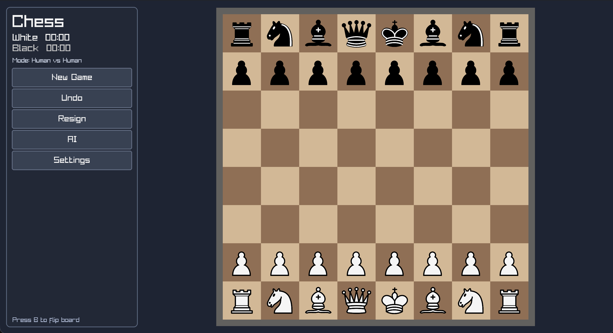
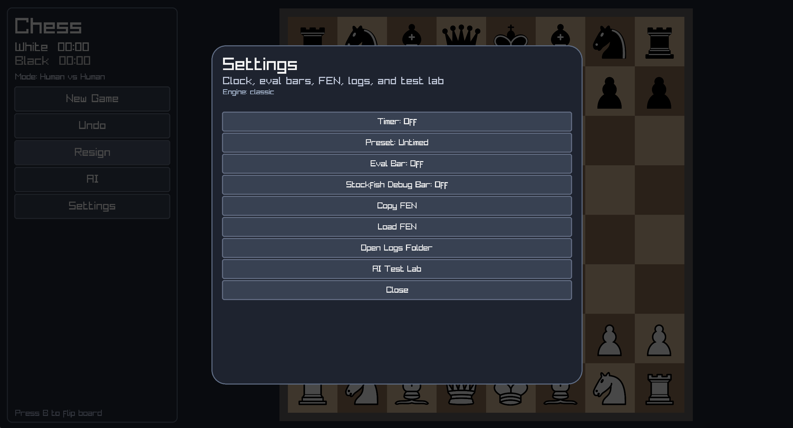
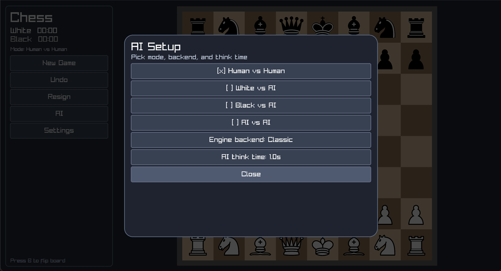
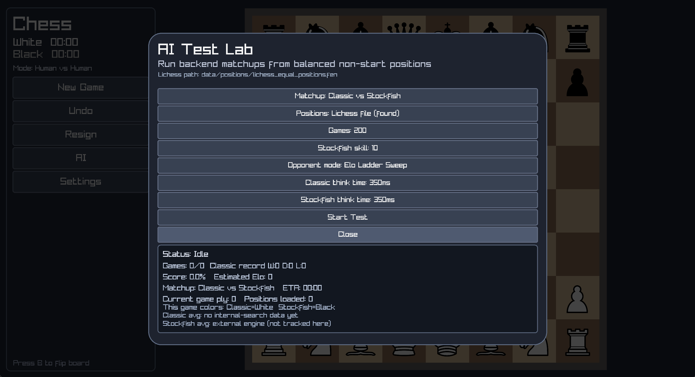

# Chess

A local chess project built around a desktop app, a C chess engine, and a Lichess bot.

The codebase is split so the core engine can be used in different ways:

- a desktop app in `src/app`
- a C engine and UCI binary in `src/core/engine`
- a Lichess/Umbrel bot stack in `src/core/bot`

The desktop side is for playing and testing locally. The engine side contains move generation, rules, search, evaluation, and the UCI entrypoint. The bot side wraps that engine for remote games and deployment.

## Repo Layout

- `src/app`: desktop UI, workers, and app assets wiring
- `src/core/engine`: rules, search, eval, UCI entrypoint
- `src/core/bot`: Lichess bot, NN tooling, and deployment pieces
- `tests`: engine, rules, and tactical regression tests
- `data`: openings, positions, and other local datasets
- `docs`: notes and specs
- `images`: app art and repo images

## Common Commands

Build the desktop app:

```bash
make
```

Run the desktop app:

```bash
make run
```

Build and run the UCI engine:

```bash
make uci
```

Run tests:

```bash
make test
```

Run the engine benchmark:

```bash
make bench
```

Run the AI Test Lab from the command line:

```bash
make ai_test_lab ARGS="--matchup classic-vs-stockfish --games 200"
bin/chess --ai-test-lab --matchup nn-vs-classic --games 50
```

Package or deploy the Umbrel bot:

```bash
make umbrel_bundle
make deploy_umbrel ARGS="user@host /target/path"
```
### Main Menu



### Settings



### AI



### AI test lab


