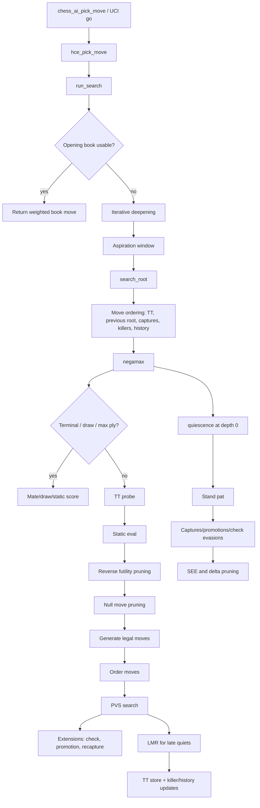
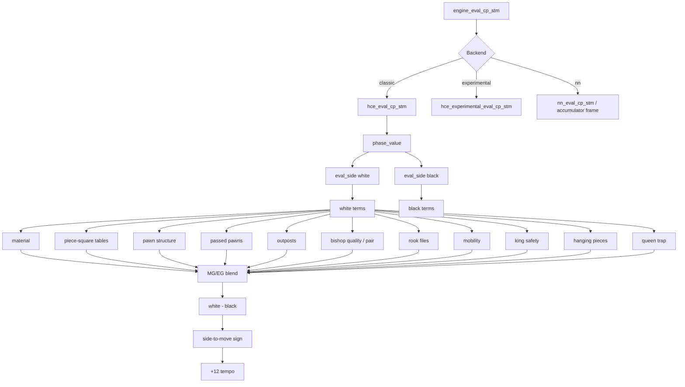

# Current HCE Map

This is the current handcrafted engine path. It covers the Classic backend and
also the search shell used by the NN backend.

## Eval Flow

## Current Tuning Hotspots

- Main-search capture ordering is MVV/LVA. Prior SEE capture-ordering variants
  were measured and rejected, so do not revive them without a new isolated
  hypothesis.
- Promotions receive a tactical bonus but are not forced above all ordinary
  captures. A promotion-first ordering test was measured and rejected.
- The eval is rich but not tuned from data. Most values are hand-balanced and
  should be treated as hypotheses.
- The current source data experiments showed early Lichess eval slices are
  opening-heavy, so any tuning/eval learning needs phase-balanced position sets.
- Search and eval both contain king-safety logic. That is good, but it means
  bad king-safety weights can amplify through extensions and move ordering.
- The Classic and NN backend share the same search shell, so search improvements
  should help both unless they depend on HCE-specific eval confidence.
